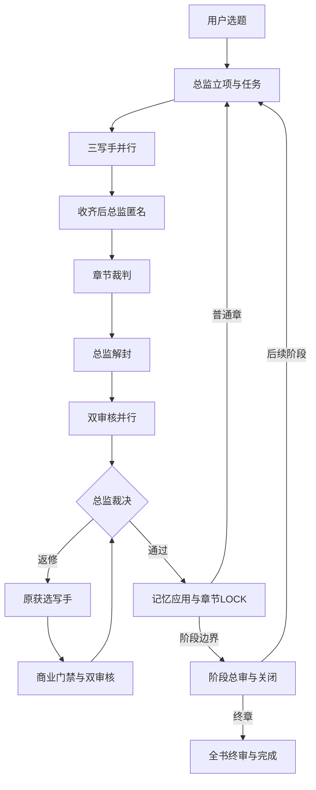

# 小说自动接力系统完整设计

版本：AUTO-0.2.0-RC2；基线：333.zip / 手动系统4.3 / 原APP4.3.2。编制日期：2026-09-18。

## 一、按用户要求保留的东西

十角色不合并：灵感员、灵感裁判、总监、写手A/B/C、章节裁判、逻辑审核员、中文文风审核员、阶段总审员。每一章仍是三稿竞争。总监独占正式设定、正式任务、积分、记忆应用与LOCK裁决。双审核互不替代。阶段边界先审计、关闭，再进入后续阶段，终章还要全书审计。

灵感员生成十个候选，灵感裁判给出可选项，最终题材由用户选择。控制台不会默认采用最高分题材。

原系统的实际顺序比口头概述多两个总监动作：三稿完成后，总监制作匿名包；裁判完成后，总监解封映射。自动版保留这两个动作，避免把具名稿直接给裁判或把未解封的裁判结果直接给审核员。

## 二、执行载体

| 载体 | 本次定位 | 依据 |
| --- | --- | --- |
| Windows＋Chrome/Edge扩展 | 实际执行端 | 可管理普通网页多个角色标签页，持久保存控制状态，并调用GitHub公开API |
| 原Android APK | 原手动基线，仅保留 | 附件没有源码和签名密钥，不能声称已经修复APK，也不能假冒原签名覆盖安装 |
| 新安卓APP与离线HTML | 手机/电脑配置工具 | 保留原字段，新增可修改学堂仓库与分支，三份草稿，ZIP导入控制台；没有后台执行权限 |
| GitHub | 正式文件、任务、凭证与控制状态 | 跨角色唯一中转；固定提交可追溯 |
| GitHub Actions | 检查代码及小说结构合同 | 不登录ChatGPT，不作为永久浏览器，不规避会员额度 |

电脑关闭后不会继续自动发任务；已有GitHub文件和任务进度保留。浏览器重启后重新输入令牌，程序重新核对在途任务，不直接把旧任务重做。

## 三、三本书与六个席位

每本书独立小说仓库，独立十个普通聊天，总共三十个角色对话。对话可以预先建立并命名；只有有任务的角色消耗执行席位。不能让三本书共用同一个总监聊天或同一个写手聊天。

全局硬上限是扩展管理的六个“已预留且尚未确认空闲”的席位。预留发生在点击发送前，包含RESERVED、SENDING、SENT、UNCERTAIN及已经验凭证但页面未确认空闲的任务。

三写手必须有三个空位才能预留；双审核必须有两个；返修复核组需要三个。只有两个空位时，三写手继续排队。三个任务的浏览器点击相差几秒，不能承诺模型在同一毫秒开始。某一成员发送失败时，已发送的成员无法撤回；其他成员保留席位，整组不会进入下一关。

轮转游标避免某一本书长期抢占。普通文件错误只阻断对应小说；账户额度、登录及GitHub身份问题可能影响全局。

网页无法直接观测服务端的真实推理线程。六席控制是程序可验证的上限，不是对服务端物理并发的保证。用户运行期间不要在这些绑定对话中另行手动发送任务；其他不受控制台管理的聊天不在计数之内。

## 四、任务与凭证

每次调度生成不可混淆的JOB_ID和随机nonce。固定输入commit、章节、角色、书号、运行状态哈希、正式TASK信息写入小说仓库 `自动化/任务/`。任务组在一次Git提交中发布，采用非强制更新，避免并行写入互相覆盖。

每个角色仍把正式正文、报告、交付放在原目录，另外写一个机器读取的结果索引到 `自动化/结果/`。输出完整回读后，记录包含产物的实际commit，最后才创建 `自动化/完成/` 凭证。凭证不能使用自己的提交SHA自引用；它绑定的是此前已落盘的产物提交。

检测器拒绝：旧任务、错书、错角色、错随机标识、提交不在当前分支历史、缺文件、清单漏正文、SHA不同、字数伪报、审核对应旧正文、重要问题未清却pass，以及总监路由越级。

`COMPLETE`表示角色交付完整，不表示小说通过审核。审核员即使判定不通过，也应完整交付失败报告并提交完成凭证，让总监生成唯一返修令。

`BLOCKED`表示工具、权限、文件或执行错误，不可当成功。阻断时不自动扩大权限，不替换正文，不偷偷改用旧版本。

## 五、GitHub完成与页面卡顿

下一阶段的业务依赖以有效GitHub凭证为准，控制台不需要读取网页正文。完成凭证之后，角色只发短ACK，减少渲染负担。

席位释放单独处理：凭证通过后，页面至少两轮呈现空闲且已过15秒，才释放。页面一直显示忙而凭证已验过120秒时，可自动刷新一次恢复显示。没有凭证时不自动刷新正在写作的对话。失去标签页、看不到编辑器或页面结构变化时保留席位。

这会在不确定时降低速度，但避免错误并发叠加。重复发送可能导致双稿、重复加分和错版本，是必须阻断的情况。

## 六、重启与重复执行

点击发送前，控制状态先写到GitHub。若发送后浏览器崩溃，重启时先核对GitHub凭证与用户任务号。找不到发送证据时保留UNCERTAIN，不自动再次点击。

任务文件发布成功、控制状态未保存就崩溃时，下一轮从已经存在的同组任务文件恢复相同编号和nonce，不新建一组。

一个GitHub控制状态只有一个活动控制台租约；其他设备不得在原实例仍有在途任务时自动接管，即使租约超时也不把旧任务当消失。单次状态更新使用文件SHA作并发检查，不强推覆盖。

这提供可恢复的任务接力；网络“点击成功但回执丢失”无法自动获得绝对确定的恰好一次保证。系统选择暂停核对，而不是以重发掩盖不确定性。

## 七、自动路由与质量关口

总监写结构化route，调度器按当前phase的允许表执行。它不能只写一句“下一章开始”就跳过审核。总监固定产物commit的原五套CI必须全部成功，missing、queued、失败均不放行。

审核目标绑定task_id和body_sha256。正文任何改动后，商业门禁、逻辑、文风都要重跑。返修只给原获选写手，最多三轮。阶段旧章修复要引用原LOCK、影响分析及阶段/终局修复范围；完成后重新审受影响阶段与全书。

模型提示词和GitHub仓库权限没有进程级角色隔离。拥有同一仓库写权限的模型理论上能越过行为规则。当前实现通过固定输入、校验、状态和CI阻止许多错误继续扩散，但不声称形成恶意行为下的权限沙箱。匿名盲评也依赖角色遵守只读范围，无法把仓库管理员隔离成完全看不见其他文件的账户。

中文文风要求保留去翻译腔、角色声线、自然句式和节奏检查；不把润色理解为隐瞒AI来源或绕过平台规则。平台适配、签约及收益不属于软件可担保的结果。

## 八、配置和凭据

学院四平台入口已真实核对。新学院没有旧文件要求的六平台决策器，因此生成器修改必读矩阵和相关角色规则，不能只替换仓库URL。生产期仍固定学院commit，短期热榜不自动改变书中设定。

GitHub令牌只保存在扩展的storage.session；不会发给ChatGPT角色、不放仓库、不写日志。三十个对话地址只保存在本机，控制仓库不保存这些地址。控制状态和小说内容仍按所选仓库的公开/私有属性可见。

不调用ChatGPT私有接口、不读取网页生成正文、不共享账户、不切换账号或模型来绕过限额。OpenAI官方说明Plus可能有动态消息上限，API另计费。本系统仍需符合适用的服务条款；不能从技术上能发送消息推导出服务方对无人值守脚本作了授权。

## 九、验收边界与下一步

目前可验：调度状态机、生成器、部分故障恢复、凭证与数据一致性。待真实账号验：网页选择器、模型是否每轮严格落盘与提交凭证、GitHub连接器写能力、Plus实际限额提示、一个完整阶段及旧章回修。

只有真实样书验收留下固定提交、凭证、CI及重启记录之后，才有依据讨论生产锁定；本包不冒用原APK的FINAL字样。

参考：[Plus说明](https://help.openai.com/en/articles/6950777-what-is-chatgpt-plus)、[OpenAI使用条款](https://openai.com/policies/terms-of-use/)、[扩展后台生命周期](https://developer.chrome.com/docs/extensions/develop/concepts/service-workers/lifecycle)、[扩展存储](https://developer.chrome.com/docs/extensions/reference/api/storage)、[GitHub分支引用更新](https://docs.github.com/en/rest/git/refs#update-a-reference)。查阅日期：2026-09-18。
